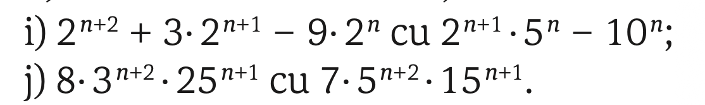
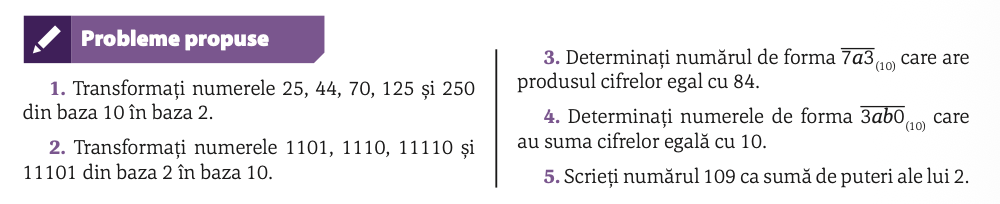

# Puteri și factor comun

## (manual Corint/p38/7)

i)

j)

## 

## Reguli de conversie dintr-o bază în alta

## ASCII și numărul de biți necesari pentru a codifica un semn/literă/caracter

## (manual Corint/p40)

### (manual Corint/p40/1)
### (manual Corint/p40/2)
### (manual Corint/p40/5)

## Câți biți e nevoie să memorezi un șir de caractere (`TOMAS IS THE BEST`) în codificare ASCII