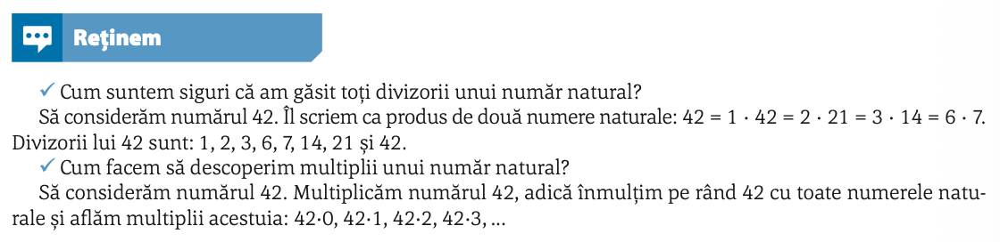
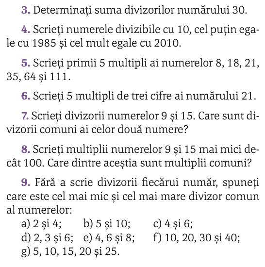
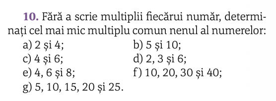

# Divizori și multipli

## Rezolvarea temei anterioare

### Determinarea lui $a$, $b$ și $c$

### Calculul lui $3^{2^{3}}$ și $2^{3^{2}}$

## Definiția divizorilor și a multiplilor

$D_8=\{1,2,4,8\}$

$M_8=\{0, 8, 16, 32, \ldots\}$

## (manual Corint/p54)

## (manual ArtKlett/p89)

Horia își organizează cele aproape 100 de DVD‑uri cu filme în cutii egale ca dimensiune. Observă
că, fără a lăsa vreun disc pe dinafară, acestea ar încăpea în cutii de câte 8 DVD‑uri, sau în cutii mai
mari, de câte 12 DVD‑uri. Câte DVD‑uri are Horia?

## `cmmmc` și `cmmdc`

`cmmmc` = cel mai **mic** multiplu comun

`cmmdc` = cel mai **mare** divizor comun

## Teme

