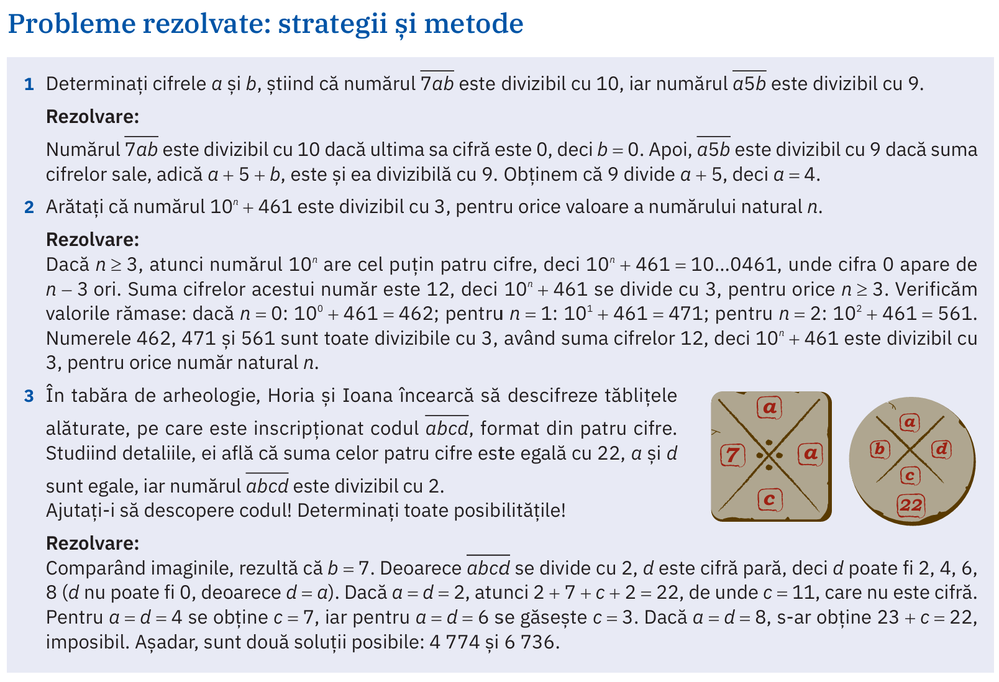
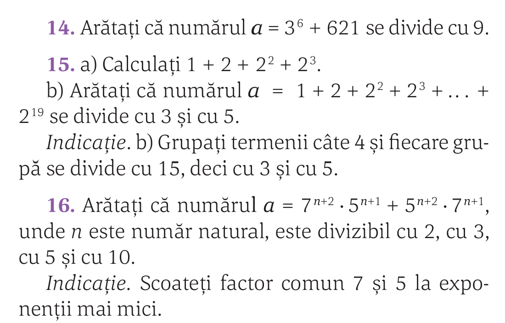
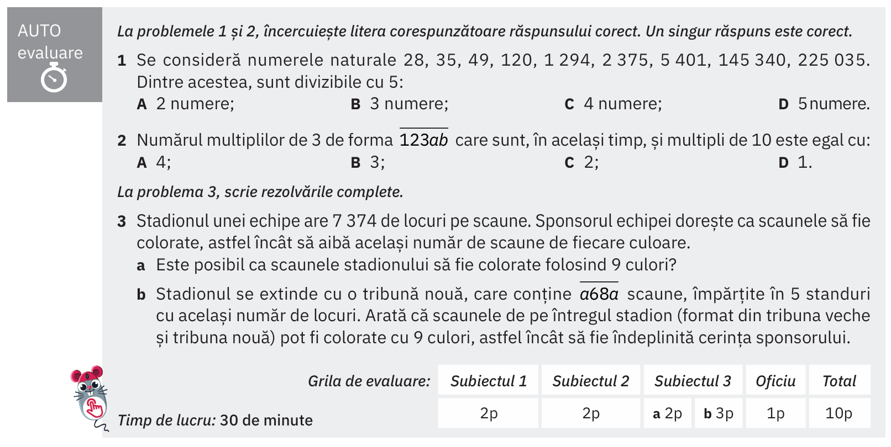
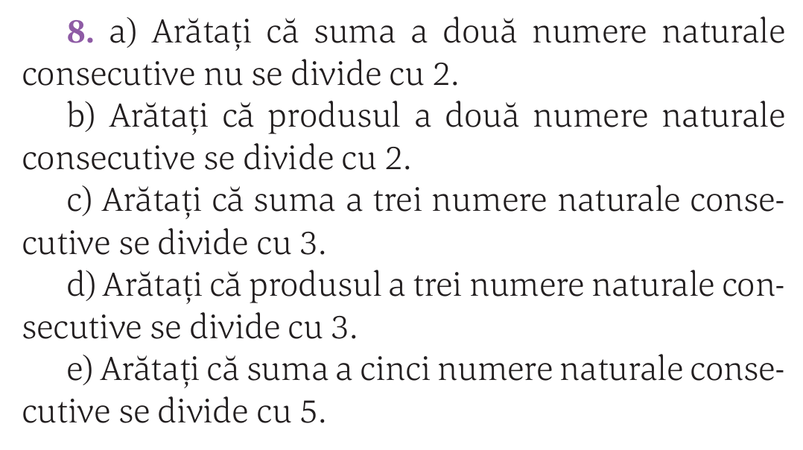

# Reguli de divizibilitate

## Regula cu 2

## Regula cu 3

## Regula cu 5

## Regula cu 9

## Regula cu 10

## Regula cu $10^n$

## Regula cu 7 (extra)

## Regula cu 4 (extra)

## (manual ArtKlett/p93)

## (manual Corint/p59)

## Temă

### (manual ArtKlett/p95)

### (manual Corint/p95)

### (manual Intuitex/p85)

