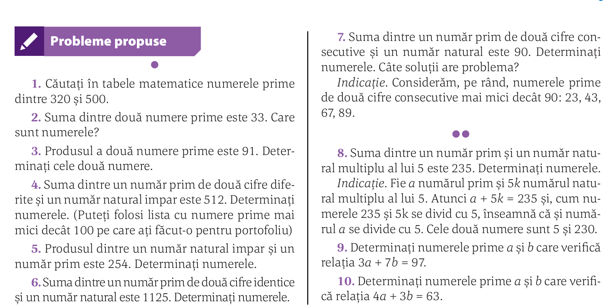
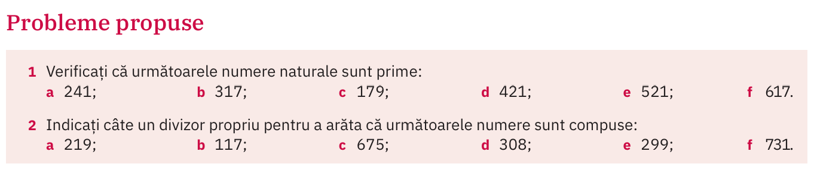

# Numere prime

## Definiții

## Ciurul lui Eratostene (276 î.e.n)

## Numerele prime până la 100

## (manual ArtKlett/p97)

Determinați numerele prime $a$ și $b$, cu $a < b$, știind că suma lor este $2 019$.

## (manual Corint/p61)

1. Căutați în tabele matematice numerele prime  dintre $320$ și $500$.
2. Suma dintre două numere prime este $33$. Care  sunt numerele?
3. Produsul a două numere prime este $91$. Determinați cele două numere.
4. Suma dintre un număr prim de două cifre diferite și un număr natural impar este $512$. Determinați numerele. (Puteți folosi lista cu numere prime mai mici decât $100$ pe care ați făcut-o pentru portofoliu)
5. Produsul dintre un număr natural impar și un număr prim este $254$. Determinați numerele.

## Temă

### (manual Corint/p61)

### (manual ArtKlett/p97)

