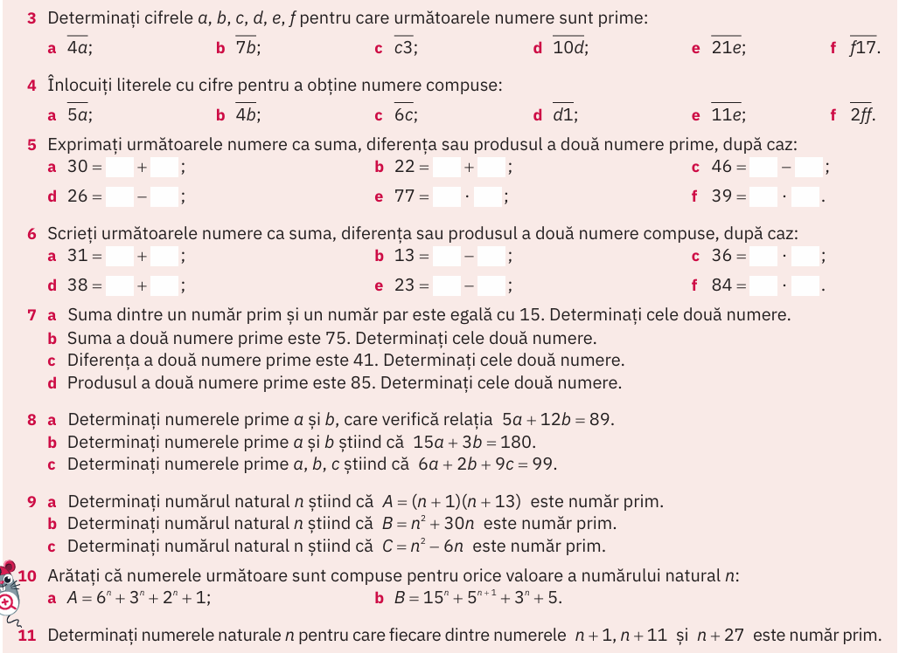

# Numere prime --- Probleme

## Rezolvarea temei

## (manual ArtKlett/p98)

### 4

### 5

### 7 a) b) c)

### 9 a) b)

## Note despre ce urmează

Recapitulare din (manual Corint/p61) și (manual Corint/p62)