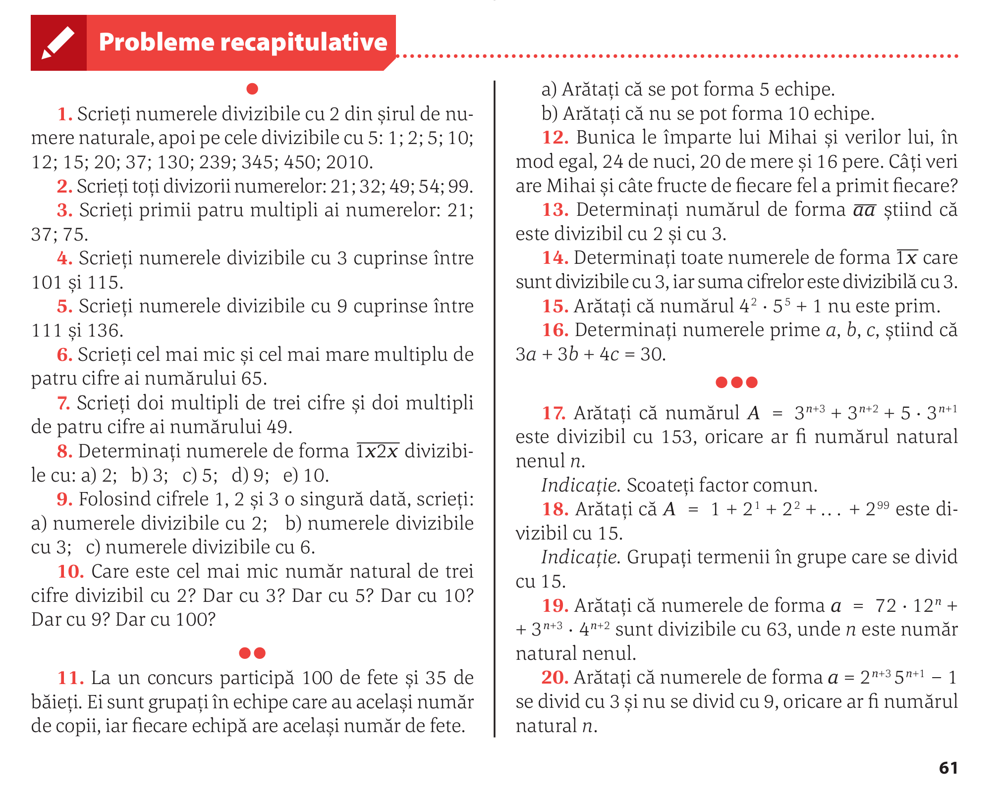

# Recapitulare Divizibilitate

## (manual ArtKlett/p98)

### 9 c)

### 10

### 11

Notăm $a = n+1$ , $b = n+11$ și $c = n + 27$.

Cheia e să considerăm $n$ relativ la $3$.

$n$ poate fi unul din:

1. $3k$
2. $3k+1$
3. $3k+2$

sSe rescriu $a$, $b$ și $c$ în funcție de cele 3 cazuri ale lui $n$.

Se observă că doar într-unul ($3k+2$ și $k=0$) se poate ca $a,b,c$ să fie prime

## (manual Corint/p61)

### 1

### 2

### 3

### 4

### 5

## Temă

Continuarea de la 7 pînă la 16.
