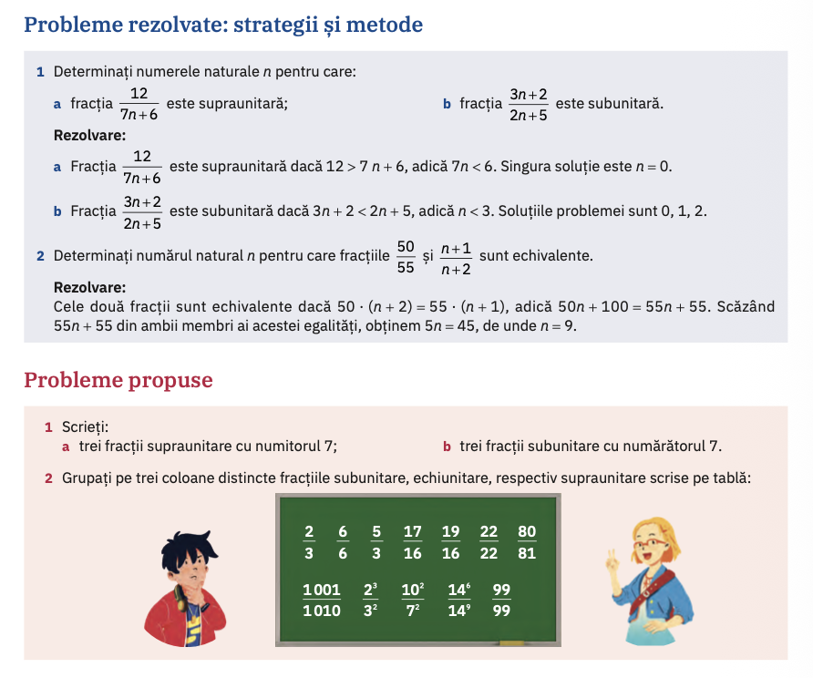
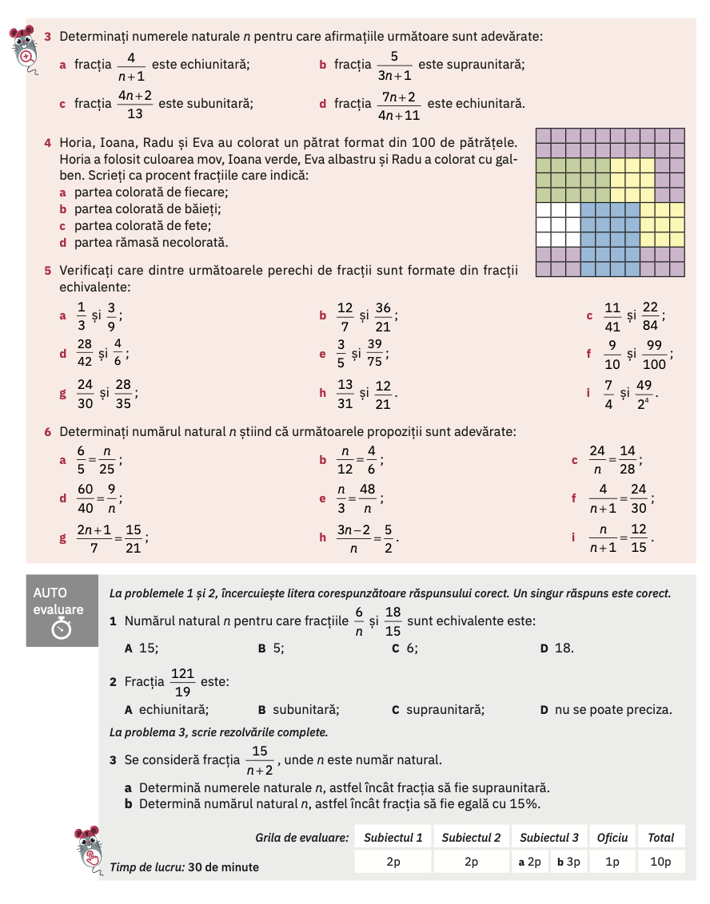
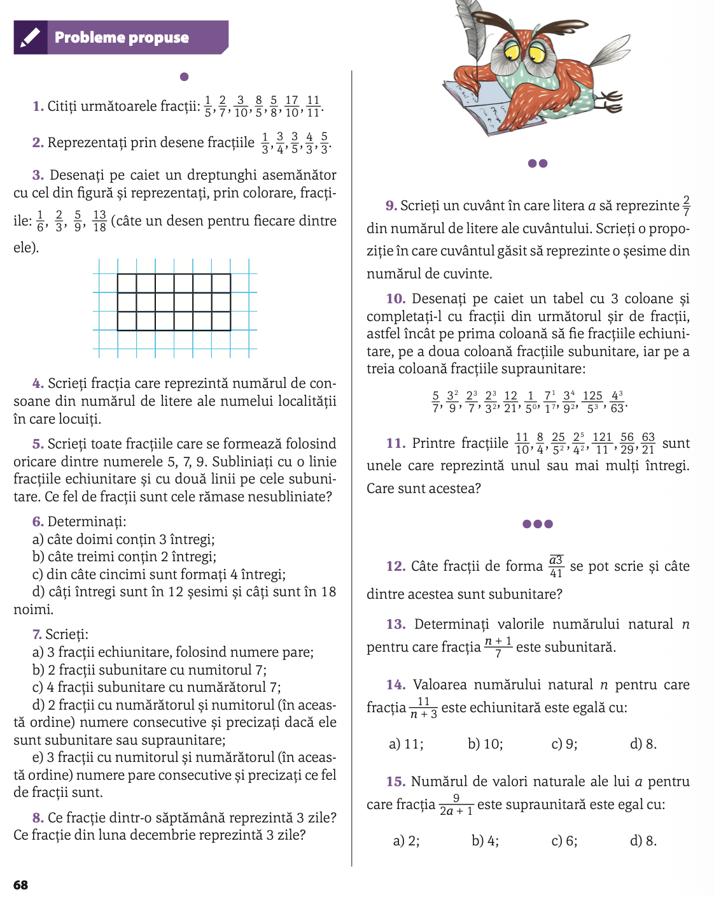

# Fracții

## Aflarea divizorilor unui număr prin metoda descompunerii în 2 factori

$a=f_1 \cdot f_2=f_3 \cdot f_4=\ldots$

## (manual ArtKlett/p104)

## (manual ArtKlett/p105)

## Temă (manual Corint/p68)

