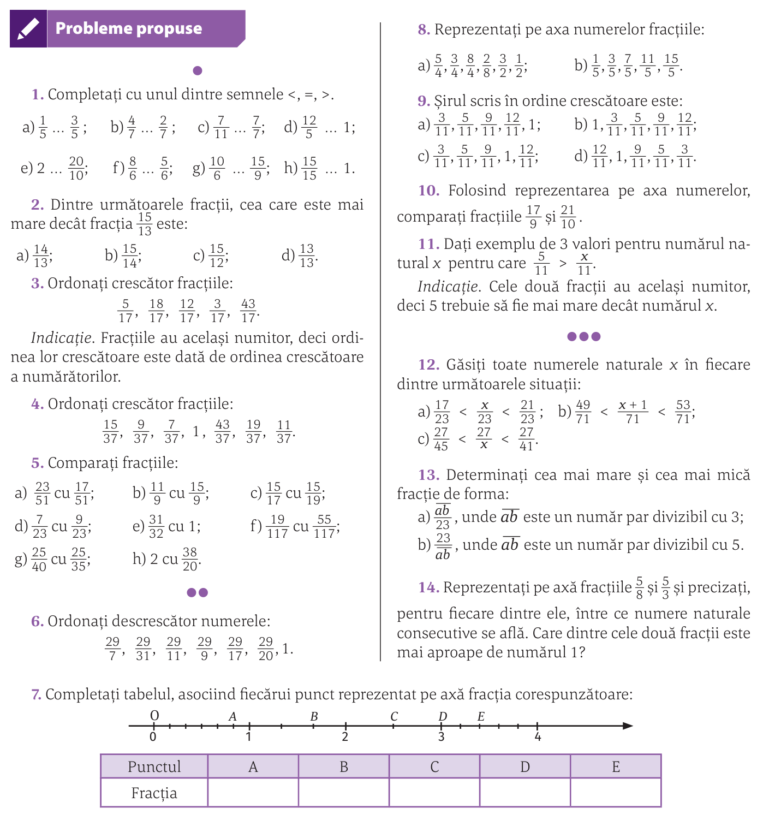
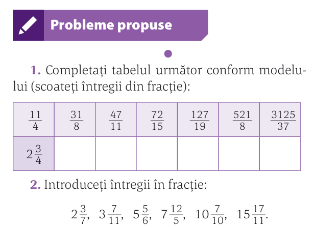
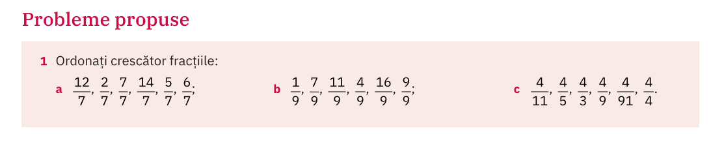
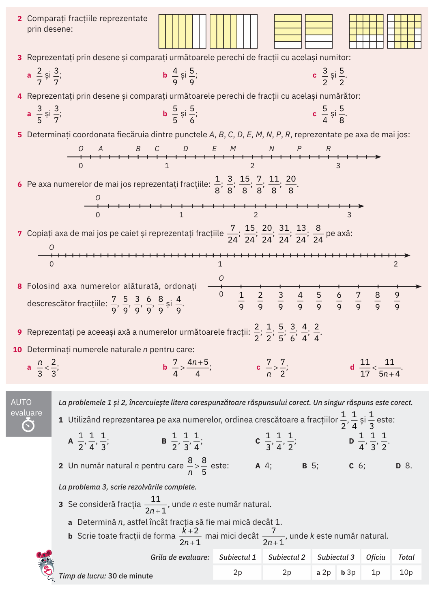
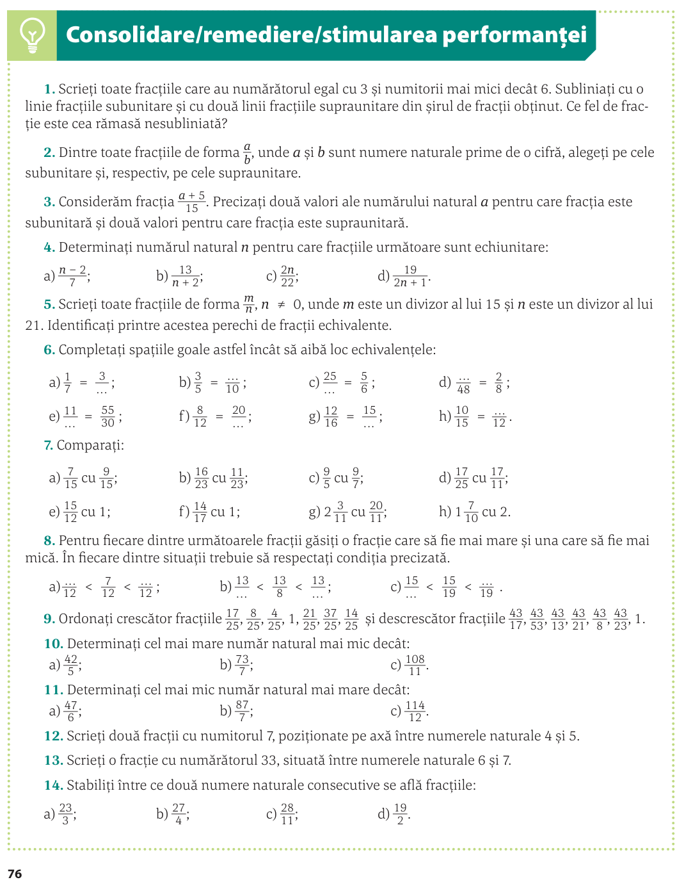

# Comparararea fracțiilor. Reprezentarea lor pe axă. Scoaterea și introducerea întregului

## Compararea fracțiilor 

### Regula generală

$\frac{a}{b}\square\frac{c}{d} \iff  a \cdot c \square b \cdot d$

### Cazuri particulare

1. același numitor
2. același numărător

## (manual Corint/p72) pr. 1-13

## Scoaterea întregului din fracție

Notația oficială e cam ciudată deoarece se poate încurca cu înmulțirea

$\frac{17}{5}=3\frac{2}{5}$

Notația preferată e cu adunare:

$\frac{17}{5}=3 + \frac{2}{5}$

Procedeul se reduce la efectuarea împărțirii cu rest:

$a:b=c(\text{rest}=r) \iff \frac{a}{b}=c\frac{r}{b}$

> _Nota Bene_
>
> Toate acestea au sens doar la fracții supraunitare.

### (manual Corint/p74) pr. 1-2

## Teme

### (manual ArtKlett/p107)

### (manual Corint/p75)

### (manual Corint/p76)

