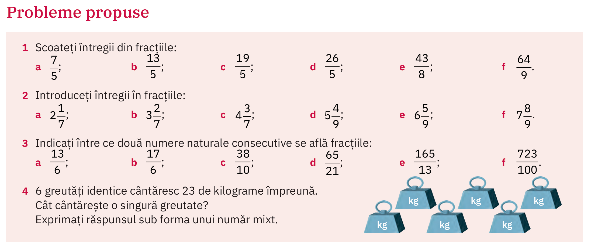
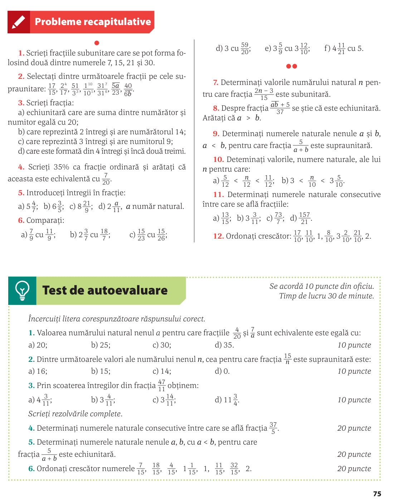

# Recapitulare întregilor din fracție. CMMDC. Amplificarea și simplificarea fracțiilor

Ce este o fracție mixtă:

\[
c\frac{a}{b}
\]

## (manual ArtKlett/p110)

### Precizați între ce două numere naturale consecutive se află, pe axa numerelor, fracția $\frac{13}{4}$

## (manual ArtKlett/p111)

### CMMDC a două numere

| nr. | divizori | divizori comuni | c.m.m.d.c. |
| --- | --- | --- | --- |
| 5 | 1, 5 | 1 | $(5, 13) = 1$ |
| 13 | 1, 13 | — | — |
| 5 | 1, 5 | 1 | $(5, 8) = 1$ |
| 8 | 1, 2, 4, 8 | — | — |
| 7 | 1, 7 | 1, 7 | $(7, 35) = 7$ |
| 35 | 1, 5, 7, 35 | — | — |

| nr. | divizori | divizori comuni | c.m.m.d.c. |
| --- | --- | --- | --- |
| 15 | 1, 3, 5, 15 | 1, 3, 5, 15 | $(15, 30) = 15$ |
| 30 | 1, 2, 3, 5, 6, 10, 15, 30 | — | — |
| 18 | 1, 2, 3, 6, 9, 18 | 1, 3, 9 | $(18, 27) = 9$ |
| 27 | 1, 3, 9, 27 | — | — |
| 24 | 1, 2, 3, 4, 6, 8, 12, 24 | 1, 2, 3, 4, 6, 12 | $(24, 36) = 12$ |
| 36 | 1, 2, 3, 4, 6, 9, 12, 18, 36 | — | — |

Analizând exemplele de mai sus, se constată că au loc următoarele proprietăți, general valabile:

1️⃣ Dacă \( a \) și \( b \) sunt două numere naturale astfel încât \( a \mid b \), unde \( a \neq 0 \), atunci  
\[
(a, b) = a
\]

2️⃣ Dacă \( p \) este un număr prim și \( a \) este un număr natural oarecare, atunci:
\[
(p, a) =
\begin{cases}
p, & \text{dacă } a \text{ este multiplu de } p \\
1, & \text{dacă } a \text{ nu este multiplu de } p
\end{cases}
\]

3️⃣ Dacă \( d \) este cel mai mare divizor comun al numerelor \( a \) și \( b \), iar \( x \) și \( y \) sunt numere naturale astfel încât  
\( a = d \cdot x \) și \( b = d \cdot y \) (unde \( x \) și \( y \) sunt câturile împărțirilor lui \( a \) și \( b \) la \( d \)),  
atunci cel mai mare divizor comun al numerelor \( x \) și \( y \) este egal cu 1.

În mod similar, prin cel mai mare divizor comun a trei sau mai multe numere naturale înțelegem acel divizor comun care se divide cu toți divizorii numerelor date.  

Din acest motiv, el este cel mai mare număr natural care divide numerele date.

---

### 🧮 Exemplu

Privind tabelul de mai sus și comparând listele divizorilor, deducem că:
- cel mai mare divizor comun al numerelor \( 24, 30, 36 \) este \( 6 \);
- cel mai mare divizor comun al numerelor \( 15, 24, 27, 36 \) este \( 3 \).

## Amplificare și simplificare

Trecere în revistă a regulii

Amplificare:
\[
\frac{x}{y}=\frac{a \cdot x}{a \cdot y}
\]

Simplificare:
\[
\frac{x}{y}=\frac{x : s}{y : s}
\]

Fracții ireductibile = fracții care nu se mai pot simplifica

Ajungem la ele prin folosirea \( \text{cmmdc}(a,b) \) 

## Temă

Vom face împreună de la lecția anterioară:

### (manual Corint/p75)

### (manual Corint/p76)

