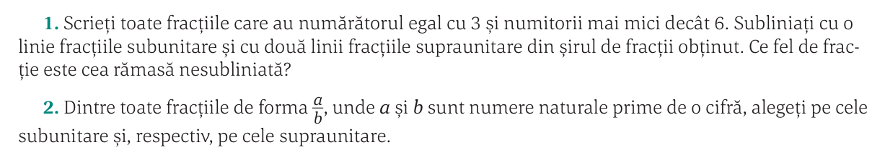
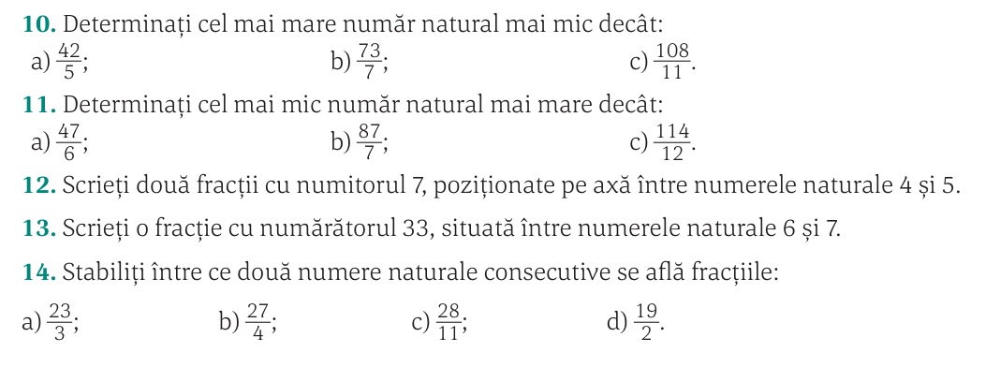
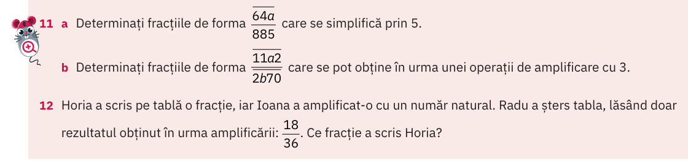
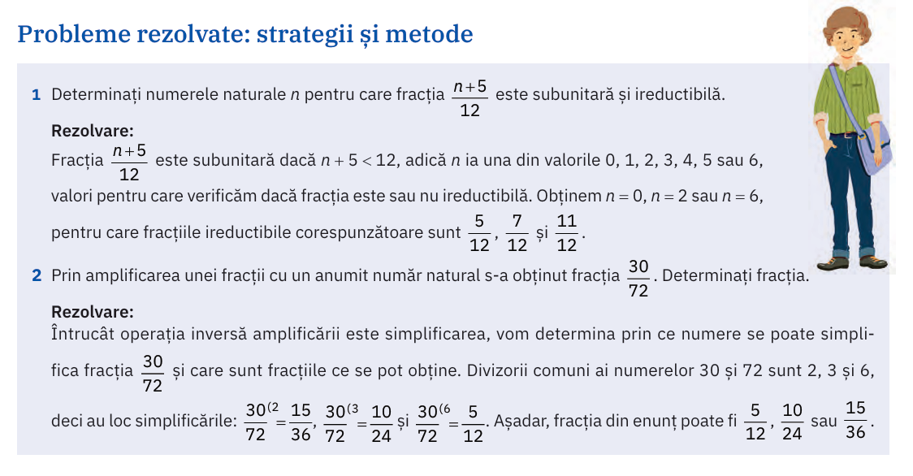
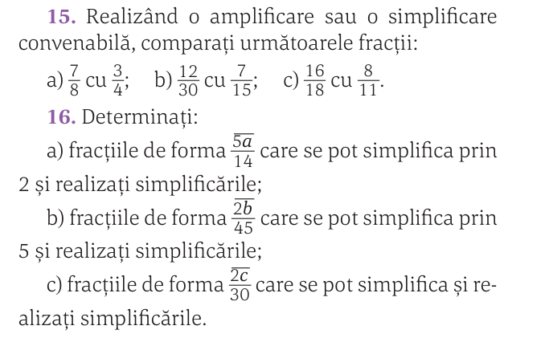
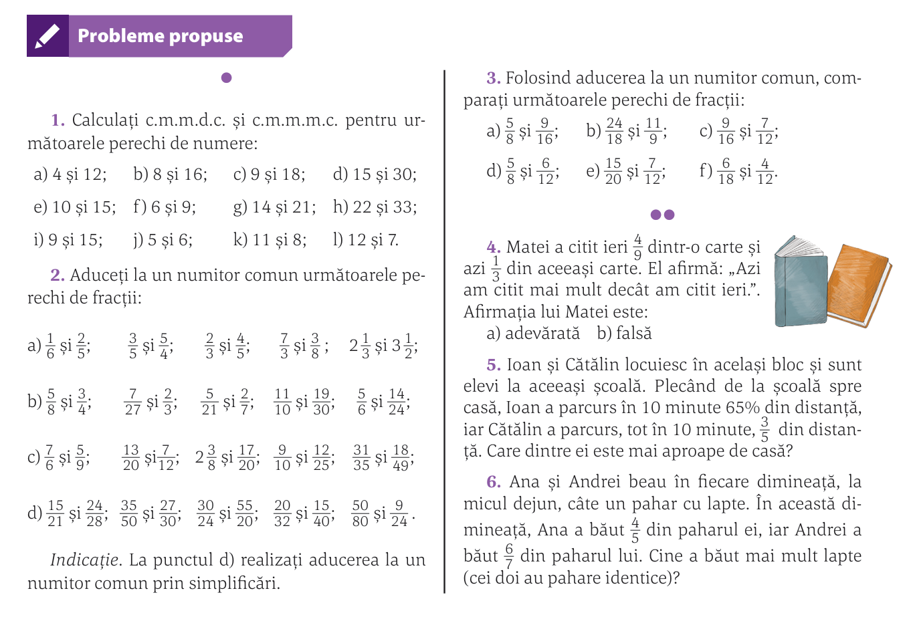
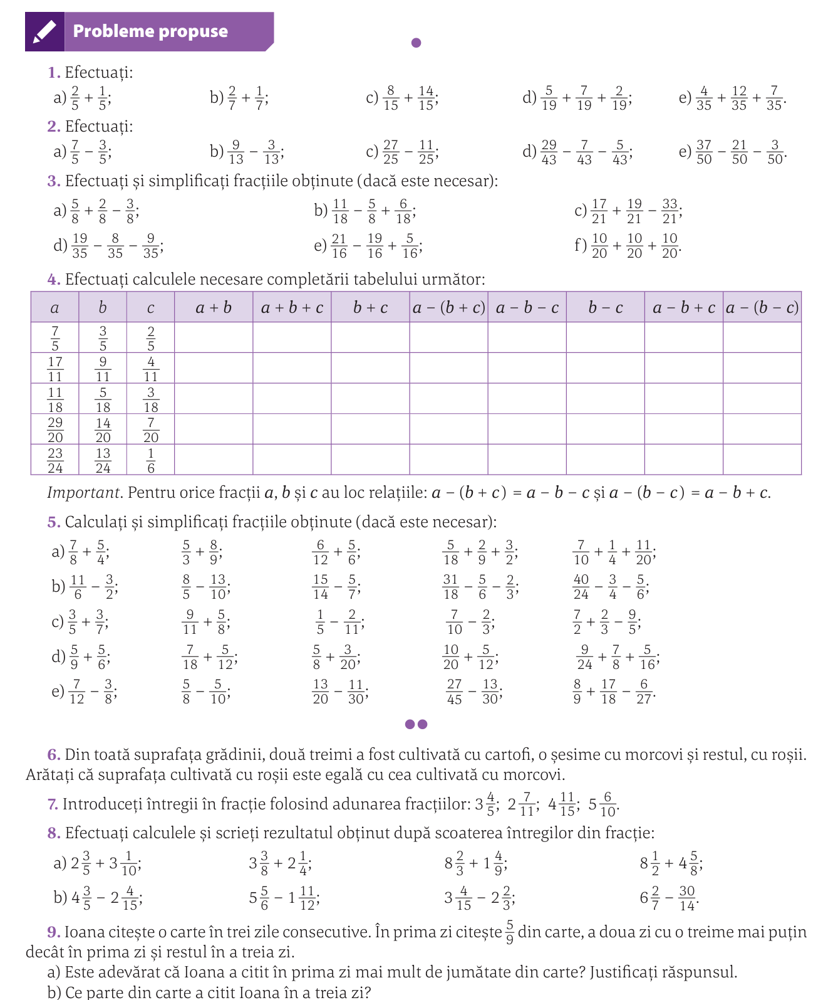

# Fracții: amplificare/simplificare/aducere la același numitor/adunări și scăderi

## Rezolvarea temei

Corectarea temei și preluarea celor care nu au fost atinse:

### (manual Corint/p74)

#### Scrieți o fracție cu numărătorul \( 33 \) situată între numerele naturale \( 6 \) și \( 7 \)

## Exerciții de amplificare/simplificare

## Aducerea la același numitor

### (manual ArtKlett/p115)

### (manual ArtKlett/p114)

1. Aflarea \( n \)-urilor care fac fracția subunitară după care eliminarea celora care o fac reductibilă

2. :warning: Aici ne-am încurcat puțin cu aflarea fracției ireductibile inițial fără să mai înțelegem cum a fost 

### (manual Corint/p82)

## Reguli de adunare/scădere fracții

\[
\frac{a}{b} \pm \frac{c}{d}=\frac{ad \pm cb}{bd}
\]

## Temă

### (manual Corint/p84/Probleme propuse)

### (manual Corint/p81/Probleme propuse)

#### Calculat `cmmdc` și `cmmmc` pentru mai multe numere

## Note

Materia se mai întinde în zona fracțiilor destul de semnificativ.

T: `1:05:52`