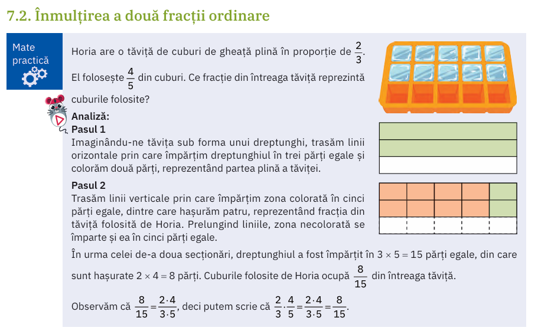
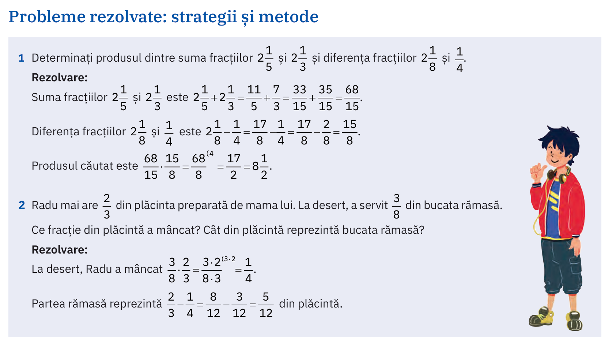
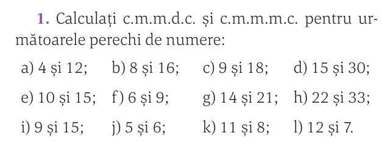
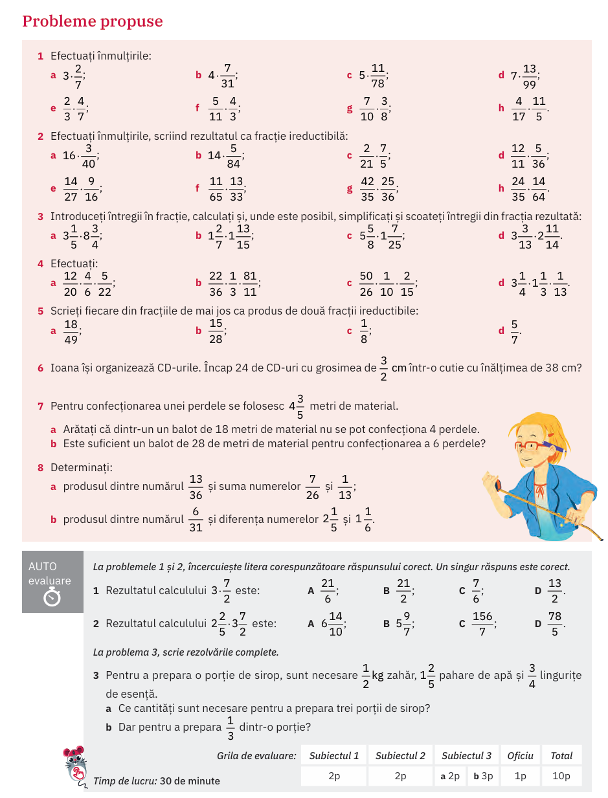

# Fracții: Înmulțirea fracțiilor (cu un număr și între ele)

## Verificarea temei

## (manual ArtKlett/p125)

## (manual ArtKlett/p126/Probleme rezolvate)

## Rezolvarea de cmmmdc și cmmmc

### (manual Corint/p83)

Observăm cîteva reguli:

\[
n_1=a \cdot \texttt{cmmdc} \\
n_2=b \cdot \texttt{cmmdc} \\
\texttt{cmmmc}=a \cdot b \cdot \texttt{cmmdc}   
\]

## Temă

### (manual ArtKlett/p127)

