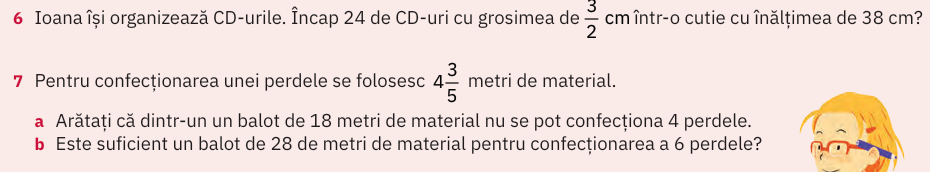
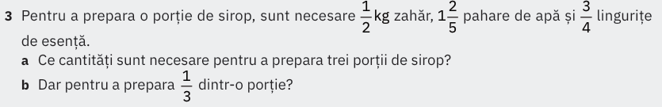
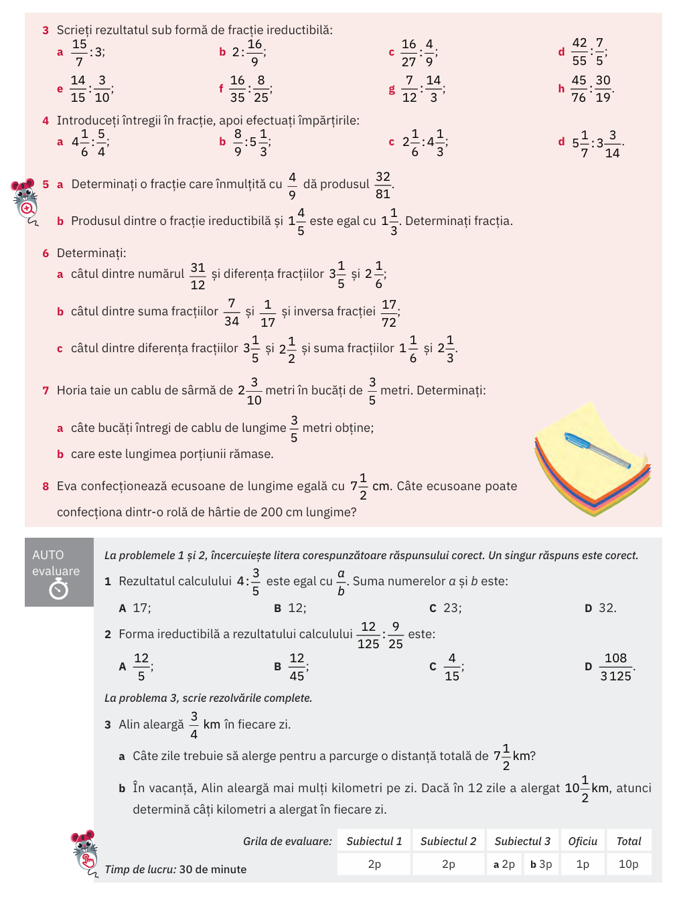

# Împărțirea fracțiilor

## Rezolvarea temei anterioare

### Verificarea dacă se poate confecționa dintr-un total un număr de $n$ bucăți

### (manual ArtKlett/p128)

## (manual ArtKlett/p127)

## Temă

### (manual ArtKlett/p130)

