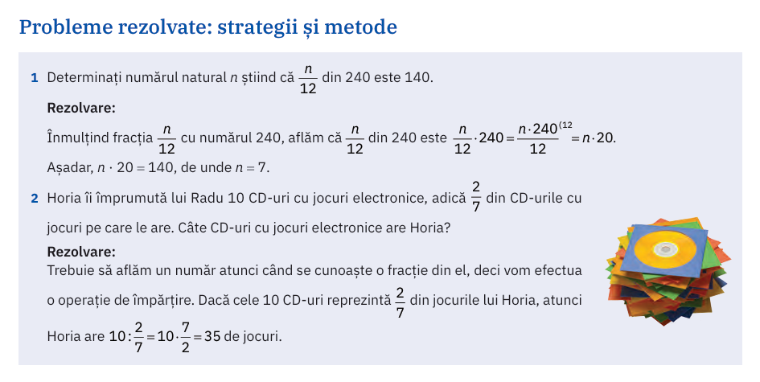
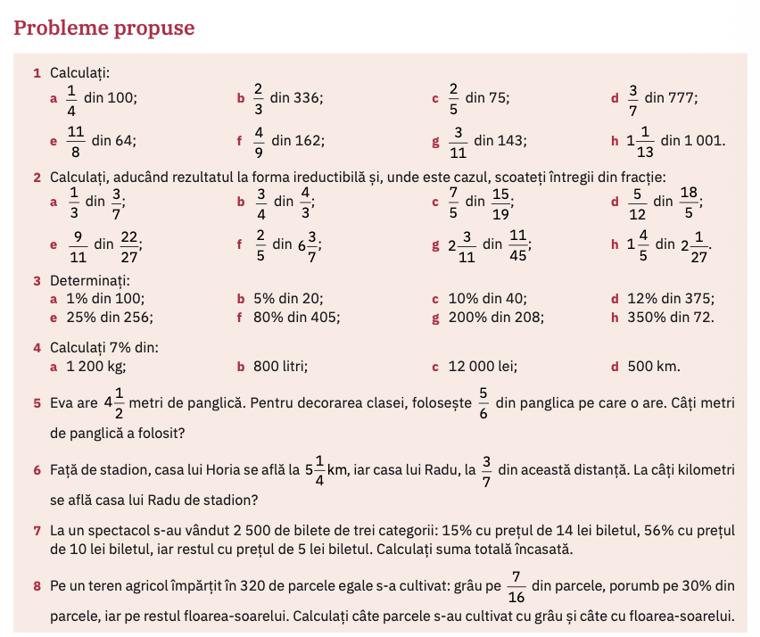

# Fracții dintr-un număr

## Aflarea unei fracții dintr-un număr natural $n$

$$
\frac{a}{b} \cdot n = \frac{a \cdot n}{b}
$$

### (manual ArtKlett/p134)

## Aflarea unei fracții dintr-o fracție

$$
\frac{a}{b} \cdot \frac{c}{d} = \frac{ac}{bd}
$$

## Aflarea unui procent dintr-un număr natural

$$
p \% \text{ din } n= \frac{p}{100} \cdot n
$$

### (manual ArtKlett/p134)

## Temă

### (manual ArtKlett/p134) Probleme propuse

