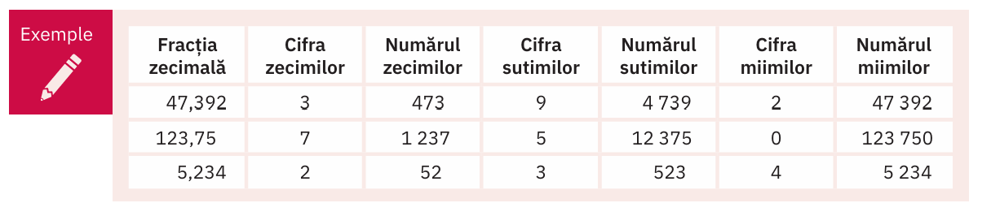
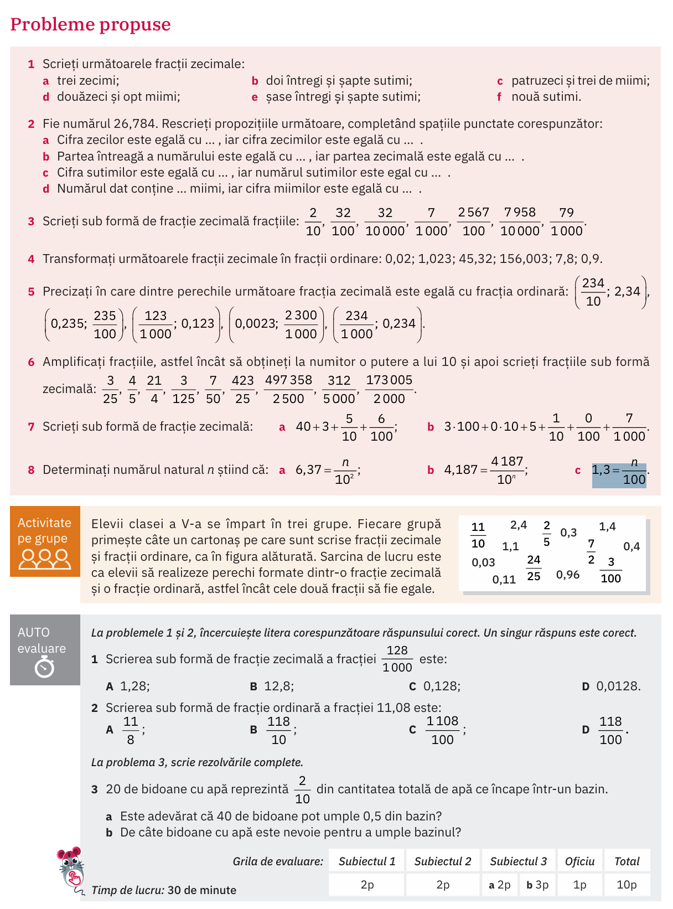

# Fracții zecimale

## Regula generală

$$
\overline{abc,def} = a \cdot 100 + b \cdot 10 + c + d \cdot \frac{1}{10}+ e \cdot \frac{1}{100}+f \cdot \frac{1}{100}
$$

## Cum numărăm zecimile, sutimile, miimile

## Temă

### (manual ArtKlett/p144)

