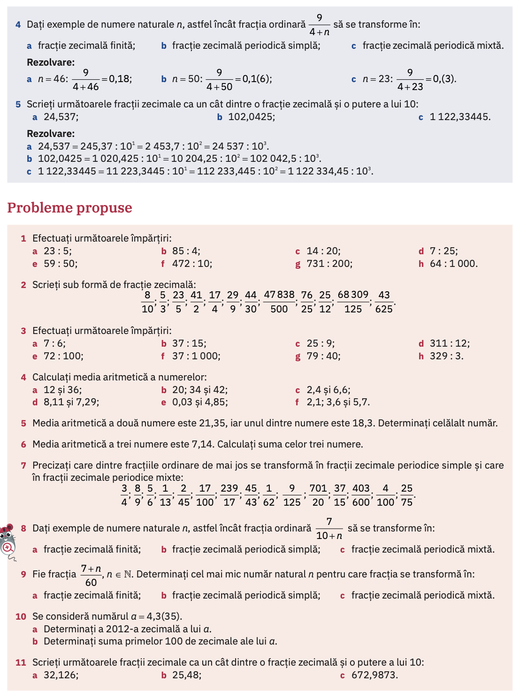
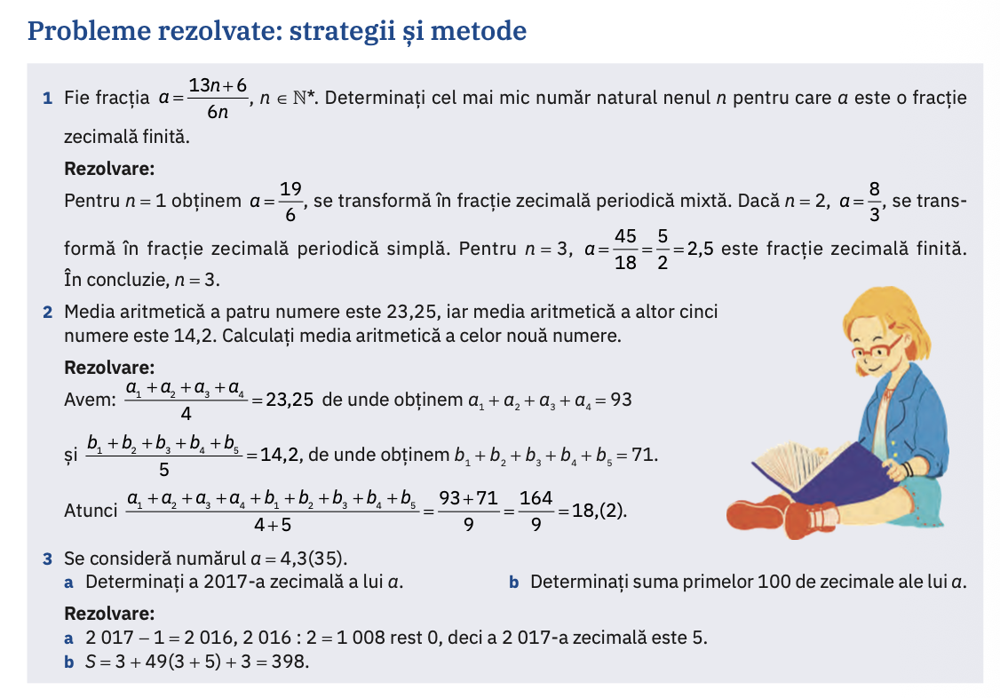

# Fracții periodice

## Tipuri de fracții zecimale

1. neperiodice $a_1,a_2a_3$
2. periodice simple $a_1,(a_2\ldots)$
3. periodice mixte $a_1,a_2a_3(a_4a_5\ldots)$

## Temă

## De făcut mai încolo

