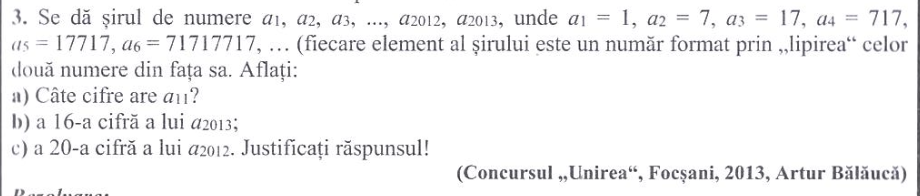
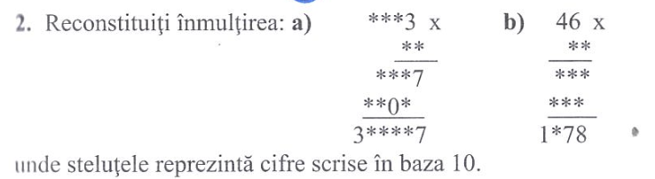
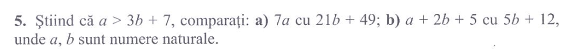
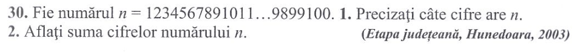

# Probleme din Aritmetică de Artur Bălăuca: Numere Naturale

## Probleme Rezolvate: 3

## Problema 2: Sudoku pe înmulțire

## Problema de cooldown: Inegalități

## Problema de la Hunedoara: p30

